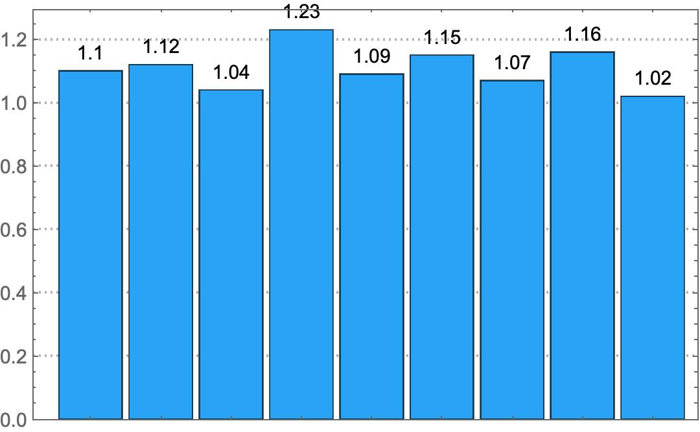
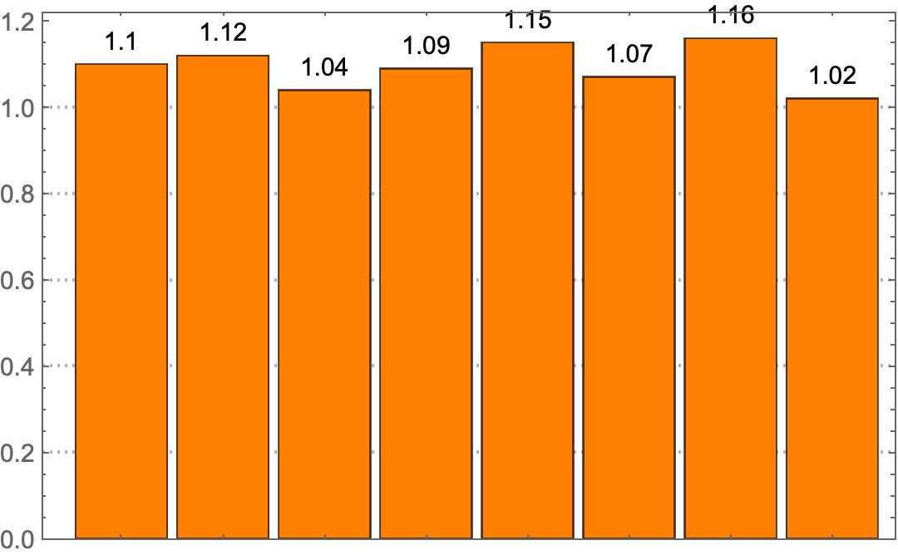
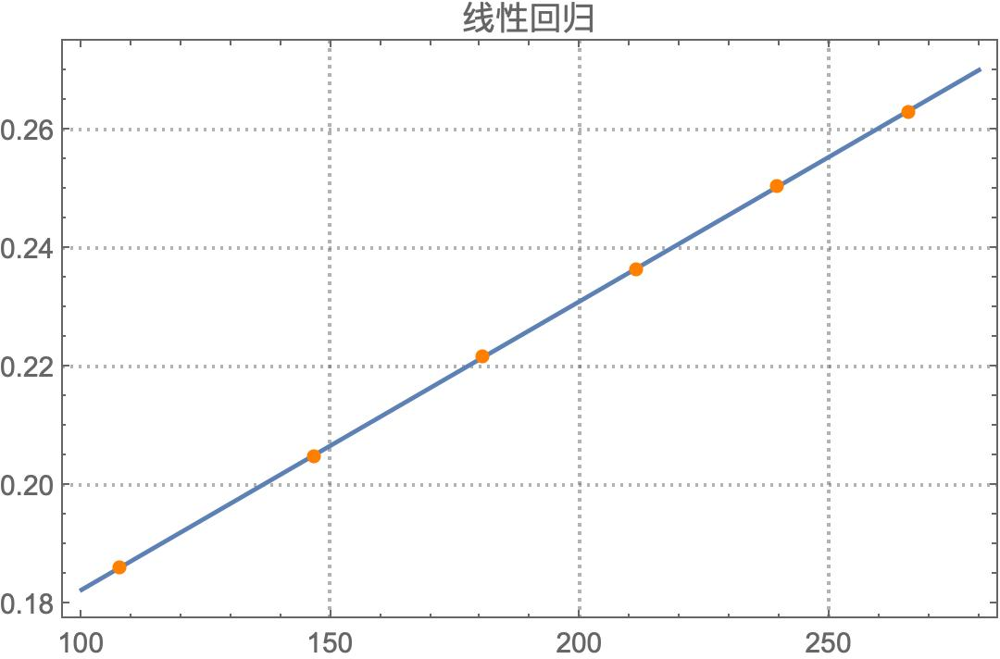
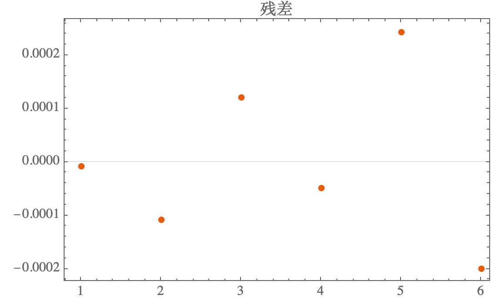
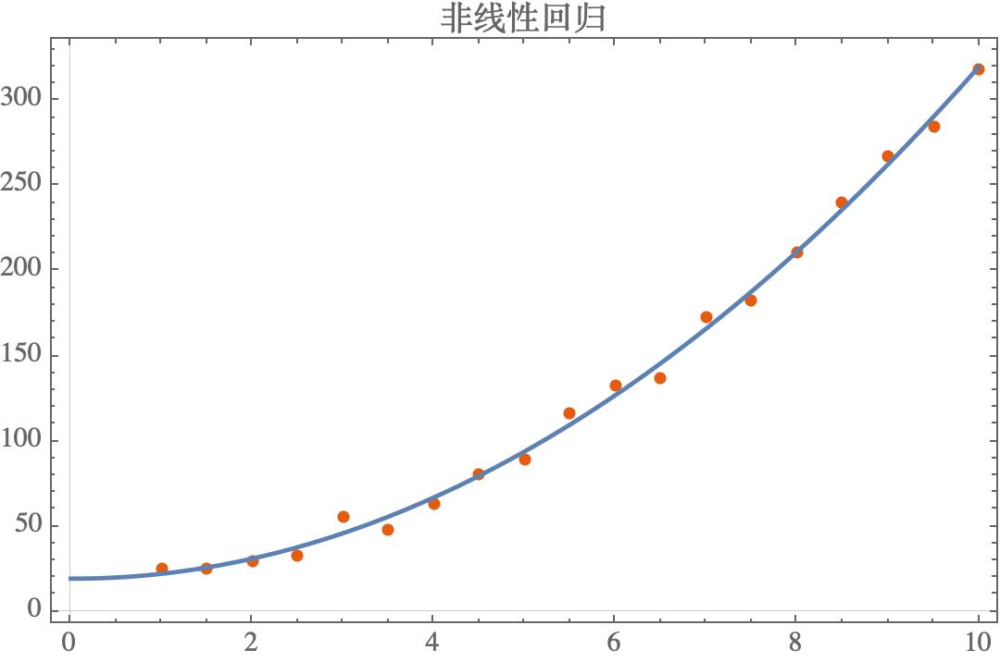
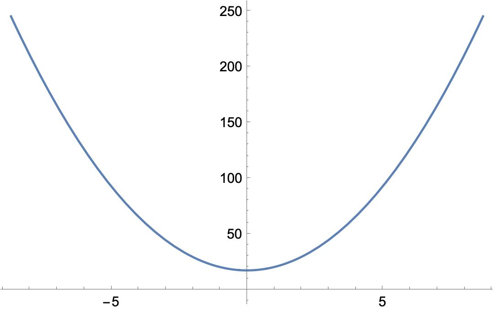

# 大物实验数据处理 DENEB v1.0.0

本平台主要聚焦于数据处理中的不确定度计算与作图环节。

打开 **DENEB.nb** 文件，可见程序分为三个部分：一维不确定度、二维不确定度以及自定义回归分析。

## 一维不确定度

首先将数据文件复制到文件夹下，在 DENEB.nb 中设置数据文件的路径：

    SetDirectory["/Users/royalty/Documents/GitHub/Data-Analysis-Plantform-for-University-Physics-Basic-Experiment"]
    
shift+enter 运行单元，然后导入文件：

    data1 = Import["sampledata1.txt", "List"]

随后的不确定度计算以及数据剔除部分，只需简单地选中单元，然后 shift + enter 即可：

    样本平均值:1.10889
    样本标准差:0.0648931
    A类不确定度:0.0499677
    B类不确定度:0.0461976
    展伸不确定度（P=0.95）:0.0680514

以及

    第 4 组数据 1.23 和平均值有最大相对偏差 10.9218%
    剔除后平均值:1.09375
    剔除后标准差:0.0495516. 相对之前变化：-0.0153415
    剔除后A类不确定度:0.0381547. 相对之前变化：-0.011813
    剔除后B类不确定度:0.0461976
    剔除后展伸不确定度（P=0.95）:0.0599166. 相对之前变化：-0.00813474

分布图已绘制于 DENEB.nb 内。

## 二维不确定度

同样，设置路径并运行：

    SetDirectory["/Users/royalty/Documents/GitHub/Data-Analysis-Plantform-for-University-Physics-Basic-Experiment"]
    
线性拟合自动绘图并给出实验报告需要的一系列数据：

    相关系数:0.962684
    截距:0.133625
    斜率:0.000487716
    各点横坐标:{107.5,146.4,180.4,211.3,239.4,266}
    横坐标平方平均值：39708.2
    斜率标准差:0.0000480112
    截距标准差:0.00956715
    斜率展伸不确定度:0.000152676
    截距展伸不确定度:0.0304235

残差

## 自定义函数的回归分析

二次函数：

符号回归：

    FindFormula[data]

绘图：

    Plot[(17.3506 + 3.01904 #1^2. &)[\[FormalX]], {\[FormalX], -8.68769, 8.68769}]

